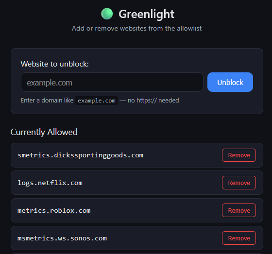
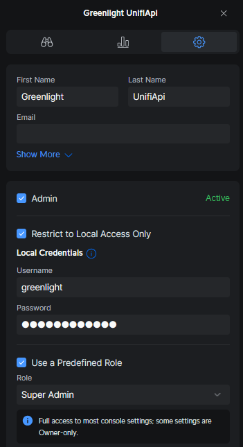
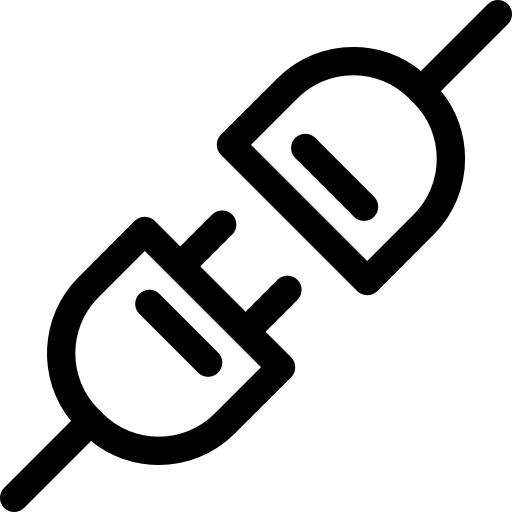
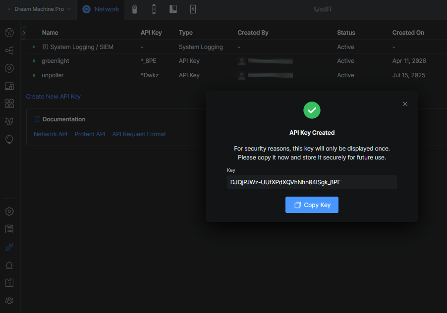
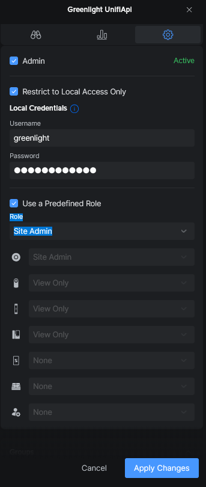

# UniFi Greenlight

<div align="center">

[](https://github.com/tscibilia/greenlight/releases)&nbsp;&nbsp;
[](https://github.com/tscibilia/greenlight/actions/workflows/build.yaml)&nbsp;&nbsp;
[](https://github.com/tscibilia/greenlight/security/code-scanning)&nbsp;&nbsp;
[](https://github.com/tscibilia/greenlight/actions/workflows/security.yaml)&nbsp;&nbsp;
[](https://github.com/tscibilia/greenlight/blob/main/LICENSE)&nbsp;&nbsp;

</div>

> A lightweight web UI for managing the allowlist on UniFi's ad-blocking content filter. Designed so family members on your local network can greenlight a website without needing access to the UniFi controller. Full disclosure, this is a vibe coded solution for personal use :robot:

<div align="center">



<details>
<summary>See it in action</summary>
<br>


</details>

</div>

## Features

- Add or remove domains from the content filter allowlist
- Simple, mobile-friendly dark UI — no login required
- Supports multiple content filter profiles (auto-detected)
- API key or username/password authentication to UniFi
- Hardened Docker container (non-root, read-only FS, no capabilities)

## Quick Start

### 0. Requirements

- UniFi OS >= 3.x
- UniFi Network >= 8.2.93

### 1. Clone and configure

```bash
git clone <your-repo-url>
cd greenlight
cp .env.example .env
```

Edit `.env` with your UniFi controller details:

```env
UNIFI_HOST=https://192.168.1.1
UNIFI_SITE=default

# Option 1: API key (preferred)
UNIFI_API_KEY=your-key-here

# Option 2: username/password
UNIFI_USERNAME=admin
UNIFI_PASSWORD=changeme
```

### 2. Run with Docker Compose

```bash
docker compose up -d --build
```

Open `http://<your-server>:3000` in a browser.

## Configuration

| Variable | Required | Default | Description |
|----------|----------|---------|-------------|
| `UNIFI_HOST` | Yes | — | UniFi controller URL (e.g. `https://192.168.1.1`) |
| `UNIFI_API_KEY` | No* | — | API key (create in UniFi OS > Admins > API Keys) |
| `UNIFI_USERNAME` | No* | — | Admin username |
| `UNIFI_PASSWORD` | No* | — | Admin password |
| `UNIFI_SITE` | No | `default` | UniFi site name |
| `FILTER_ID` | No | — | Restrict UI to a specific filter ID |
| `PORT` | No | `3000` | App listen port |

\* Either `UNIFI_API_KEY` or both `UNIFI_USERNAME` and `UNIFI_PASSWORD` must be set.

## Authentication

Greenlight supports 2 styles of authentication:

- UniFi API Key
- Username & Password (Deprecated)

Click the below headers to view the instructions:

<details>
<summary>UniFi API Key — Network v9.0.0+</summary>
<br>

API key authentication is the recommended method. It avoids session management overhead, doesn't expire on idle, and works with UniFi Network v9.0.0 and later.

1. Open your UniFi controller/Console's admin page either via [unifi.ui.com](https://unifi.ui.com) or via the IP address of your controller

2. On the left navigation bar (that runs the length of the page) click the *people* icon (`Admin & Users`)

3. Click `+ Create New` at the top of the page and fill it out using the below details

| Field Name                    | Value                                   |
|-------------------------------|-----------------------------------------|
| First name                    | `Greenlight`                            |
| Last name                     | `UnifiApi`                              |
| Admin                         | :white_check_mark:                      |
| Restrict to local access only | :white_check_mark:                      |
| Username                      | `greenlight`                            |
| Password                      | Make up a password, but make note of it |
| Use a pre defined role        | :white_check_mark:                      |
| Role                          | `Super Admin`                           |

Your user should now look like the below



4. Login to your console as the user you have just created. This will need to be done via the controller's IP address

5. On the left navigation bar (that runs the length of the page) click the <picture><source media="(prefers-color-scheme: dark)" srcset="assets/connect-darkmode.png"></picture> icon (`Integrations`)

Give the API key a name, something like `greenlight`

Copy this Key, we will need it later. Your page should now look like the below



6. Remove elevated permissions from the user

Log back in as your normal account, head over to where we created the Greenlight UnifiApi account
(On the left navigation bar (that runs the length of the page) click the *people* icon (`Admin & Users`))

Open that account, click the **Gear Icon** then match the below

We have unselected **Use a Predefined Role** and changed the *ufo* icon to `Site admin` and the *person* to `None`



You're probably thinking *wow, that was long*, and it's because only super admins can create API Keys, but they do not need
those permissions the entire time to be able to *have* API Key attached to that user. It's a ~bug~ feature in UniFi

The `Site Admin` permissions are more than enough to allow that user to create and manage records in our controller

7. Create a Kubernetes secret called `greenlight-secret` that will hold your `UNIFI_API_KEY` with their respected values from Step 3.

```yaml
---
apiVersion: v1
kind: Secret
metadata:
    name: greenlight-secret
stringData:
  UNIFI_API_KEY: <your-api-key>
```

```env
UNIFI_HOST=https://192.168.1.1
UNIFI_API_KEY=your-key-here
```

</details>

<details>
<summary>Username & Password (Deprecated)</summary>
<br>

> [!WARNING]
> Username/password authentication is deprecated and may be removed in a future release. Migrate to API key authentication when possible.

Set `UNIFI_USERNAME` and `UNIFI_PASSWORD` in your `.env`. The app manages login sessions automatically and re-authenticates when the session expires.

```env
UNIFI_HOST=https://192.168.1.1
UNIFI_USERNAME=admin
UNIFI_PASSWORD=changeme
```

</details>

## Custom UID/GID

The container defaults to UID/GID `1000`. Override at build or runtime:

```bash
# Build-time
docker build --build-arg APP_UID=65534 --build-arg APP_GID=65534 -t greenlight .

# Docker Compose (via environment or .env)
APP_UID=65534 APP_GID=65534 docker compose up -d --build
```

For Kubernetes, use `securityContext`:

```yaml
securityContext:
  runAsUser: 65534
  runAsGroup: 65534
  runAsNonRoot: true
  allowPrivilegeEscalation: false
```

## Security

### Container Hardening

The Docker container follows least-privilege principles to minimize blast radius:

- **Non-root user** — runs as UID/GID 1000 by default (configurable via build args)
- **Read-only filesystem** — only `/tmp` is writable; no persistent state in the container
- **All capabilities dropped** — `cap_drop: ALL`, no Linux kernel capabilities granted
- **No privilege escalation** — `security_opt: no-new-privileges` prevents setuid/setgid binaries
- **Self-signed TLS** — accepted for UDM connections (standard for local UniFi controllers)

### Input Validation & Injection Prevention

All user input is validated and sanitized at multiple layers to prevent XSS, injection, and abuse:

- **Strict domain regex** — the backend only accepts domains matching `^[a-z0-9]([a-z0-9-]*\.)+[a-z]{2,}$`, rejecting any input containing JavaScript, HTML, special characters, or path traversal attempts
- **Input normalization** — domains are lowercased with protocols, `www.` prefixes, paths, and whitespace stripped before validation
- **Type and length enforcement** — domain input must be a string of 253 characters or fewer (the DNS maximum)
- **Filter ID validation** — route parameters are validated against MongoDB ObjectId / UUID formats, preventing path manipulation in upstream API calls
- **HTML escaping** — all domain values are escaped before rendering in the frontend
- **Content Security Policy** — Helmet enforces strict CSP headers with per-request script nonces, blocking inline script injection even if a value were somehow rendered unescaped
- **Rate limiting** — API endpoints are capped at 30 requests/minute to prevent brute-force or spam abuse
- **JSON-only API** — the server only accepts `application/json` request bodies, eliminating form-based CSRF vectors

> **Note:** Domain values are sent to the UniFi controller as string elements in a JSON array. They are never interpolated into shell commands, URL paths, or database queries — there is no path from the domain input to command execution on the router.

## How It Works

The app uses UniFi's undocumented v2 content-filtering API:

1. **Authenticate** — `POST /api/auth/login` (or API key header)
2. **List filters** — `GET /proxy/network/v2/api/site/{site}/content-filtering`
3. **Update filter** — `PUT /proxy/network/v2/api/site/{site}/content-filtering`

The update endpoint auto-negotiates the correct method/path for your firmware version.

## Project Structure

```
greenlight/
├── src/
│   ├── server.js          Express server + API routes
│   └── unifi-client.js    UniFi API client
├── public/
│   ├── index.html         Single-page UI
│   ├── style.css          Dark theme styles
│   └── app.js             Frontend logic
├── Dockerfile             Multi-stage, non-root
├── docker-compose.yml     Production-ready config
├── .env.example           Configuration template
└── package.json
```

## License

MIT
